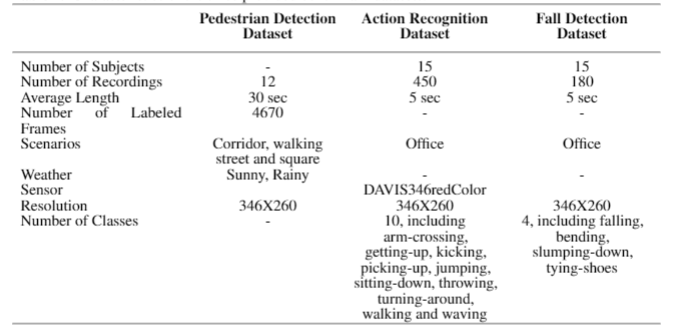

# pedestrian_detection

## TODO

- [x] Create standard model
- [x] Make the dataset downloadable (see next point)
- [x] Make the repository public
- [x] Test with the whole dataset (see "Dataset Structure & File Descriptions: OneDrive Repository")
- [ ] Implement Hypparameters Optimization (HPO)
    - [x] "pedestrian_detection_multitask_snn.ipynb"
    - [ ] "pedestrian_detection_grid.ipynb"
    - [ ] "pedestrian_detection_fpn_snn.ipynb"
- [ ] Modify the code to make it work also on Colab
    - [x] "pedestrian_detection_multitask_snn.ipynb"
    - [ ] "pedestrian_detection_grid.ipynb"
    - [ ] "pedestrian_detection_fpn_snn.ipynb"
- [ ] Improve code readability and documentation
    - [x] "pedestrian_detection_multitask_snn.ipynb"
    - [ ] "pedestrian_detection_grid.ipynb"
    - [ ] "pedestrian_detection_fpn_snn.ipynb"
- [ ] Improve code efficiency
    - [x] "pedestrian_detection_multitask_snn.ipynb"
    - [ ] "pedestrian_detection_grid.ipynb"
    - [ ] "pedestrian_detection_fpn_snn.ipynb"
- [ ] Choose one of the two possible approaches to face the Pedestrian Detection task (see "Evaluating Spatial Grid Detection vs. Temporal Presence Verification in Neuromorphic Vision")
    - [x] added a better version of the pedestrain detection task "pedestrain_detection_fpn_snn.ipynb" (it takes around 80 minutes to train), the accuracy indicated still only accounts for the presence or not of a pedestrain, not the 1 to 1 match of the true and the predicted boxes. However as you can see from the images the results are not that bad. Also I think that the SNN treats it like an RGB image but maybe we can transform it to a gray scale image to save up time and compute.
    Things that can be improved:
        - loss
        - RGB -> gray scale (from 3 channels to 1 channel)
        - etc.

---
## Evaluating Spatial Grid Detection vs. Temporal Presence Verification in Neuromorphic Vision
### Approach A: Dense Grid-Based Multi-Object Detection

* **Concept:** This approach partitions the spatial dimension of the input into a localized grid or cell structure. Each cell is independently responsible for predicting the "objectness" probability and calculating precise localized bounding box coordinate offsets for any pedestrian within its boundaries.
* **The SNN Challenge:** Training Spiking Neural Networks (SNNs) to regress precise, high-resolution continuous coordinates across a dense grid introduces immense gradient instability. Because event-based data primarily captures temporal changes (motion contours) rather than static textures, forcing a spike-based architecture to maintain fine-grained spatial representations across multiple simultaneous targets leads to extreme convergence issues during backpropagation.

### Approach B: Global Presence Verification with Coarse Localization

* **Concept:** This approach shifts the primary objective to the temporal domain. The network processes the spike sequence globally over a fixed set of simulation timesteps to evaluate human presence within the frame (binary classification), optionally paired with a single, image-wide bounding box regression.
* **The SNN Advantage:** SNNs inherently excel at accumulating sparse, temporal evidence via membrane potential dynamics over time. Determining *if* an object with the distinct motion dynamics of a pedestrian is moving through the event stream aligns perfectly with the biological strengths of spiking neurons, making the loss function significantly more direct and stable.

### Why Approach B is Signficantly More Advantageous

For an event-based pedestrian detection project driven by spike-encoded data, **Approach B** represents the most structurally sound and efficient engineering choice due to the following core reasons:

* **Exploitation of Neuromorphic Sparsity:** Event-based sensors only generate spikes when pixels detect motion. Approach B treats the network as an efficient temporal accumulator, leveraging the natural sparsity of the data to trigger a positive classification only when a meaningful train of spikes crosses the neural threshold.
* **Gradient Convergence and Stability:** Eliminating a complex multi-cell grid removes the need for highly volatile, multi-task loss configurations (balancing background cell suppression against coordinate regression). This drastically simplifies the gradient flow through surrogate derivatives, leading to faster and highly reliable network convergence.
* **Perfect Alignment with "Wake-Up" Edge Architectures:** In neuromorphic computing and MLOps workflows, a global presence SNN acts as an ultra-low-power **wake-up trigger**. It maintains a near-zero power profile to continuously monitor the environment, delegating computationally heavy tracking to downstream systems only when a human presence is verified—fully realizing the architectural intent of edge intelligence.

---

## Dataset Structure & File Descriptions: OneDrive Repository

### 1. What "Raw pedestrian data" Files Represent

The **12 files** with the **`.aedat`** extension (`1.aedat` to `12.aedat`) are raw, asynchronous recordings captured using a **DAVIS346redColor event-based camera** with a resolution of **346x260** (as summarized in the following image).

* Unlike traditional frame-based cameras, this neuromorphic sensor records only pixel-level changes in brightness as a continuous stream of events defined by timestamp, $(x, y)$ coordinates, and polarity.
* Each recording has an **average length of 30 seconds**, capturing pedestrians walking across real-world environments including corridors, streets, and squares under varying weather conditions (**Sunny and Rainy**).

### 2. How They Relate to the "train" Folder

Because deep learning models cannot directly ingest raw, continuous event streams, the neuromorphic data is pre-processed into a standard dataset format. The **"train"** folder contains the structured outputs of this transformation:

* **"pedestrian frame":** The continuous event streams from the 12 `.aedat` recordings are accumulated over fixed time windows to reconstruct **4,670 2D frames**, highlighting moving subjects while filtering out static backgrounds.
* **"pedestrian label":** This folder contains **4,670 corresponding ground-truth annotations** (bounding boxes), mapping the precise locations of the pedestrians for binary object detection.

### Summary

**"Raw pedestrian data"** contains the 12 original neuromorphic video sequences (30s each, 346x260 resolution) from the DAVIS sensor. **"train"** represents that same source material sliced, integrated, and annotated into a ready-to-use dataset of 4,670 frame-label pairs for model training.

---